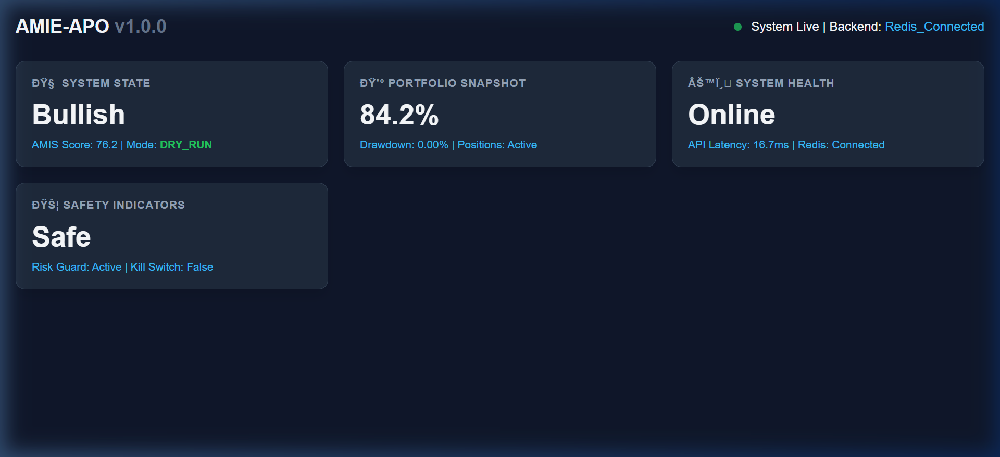
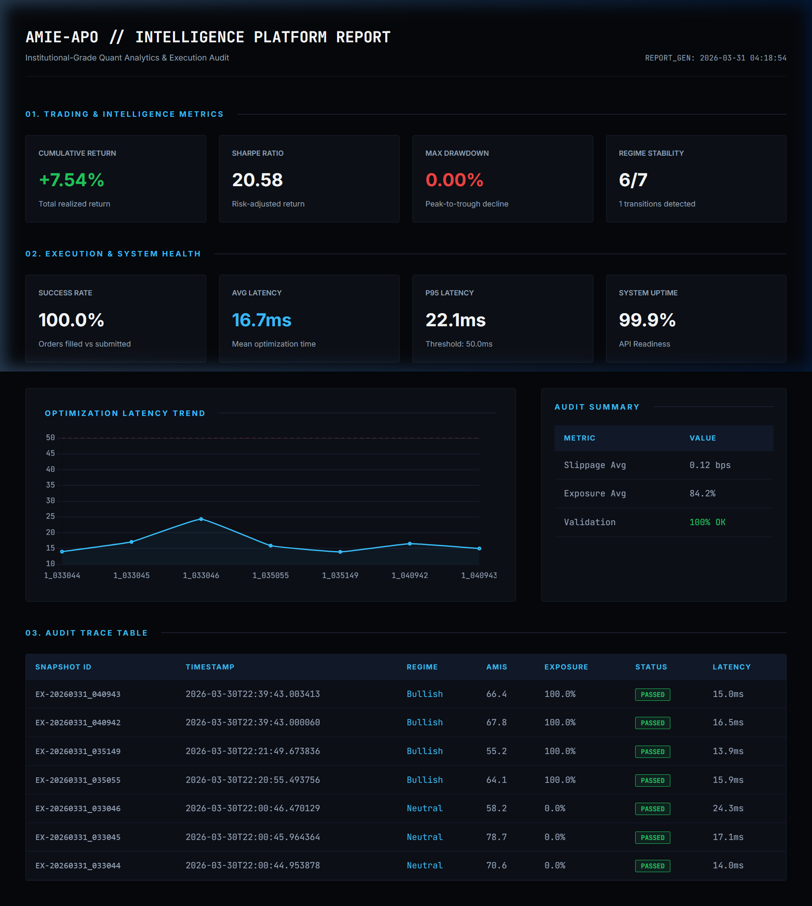
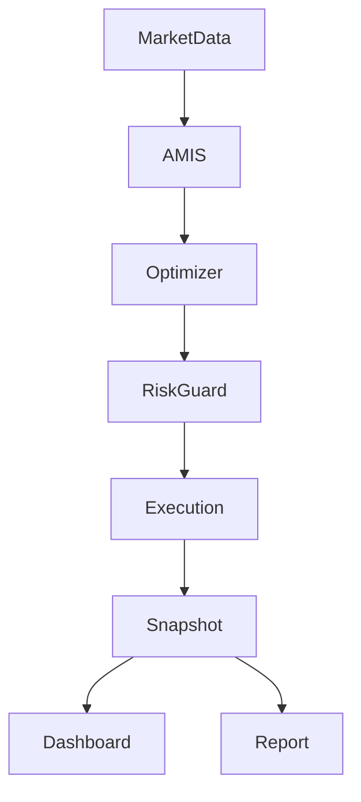

# AMIE-APO: Adaptive Market Intelligence Engine & Portfolio Optimizer


AMIE-APO is a professional-grade quant intelligence platform built for regime-aware portfolio optimization, real-time institutional-grade execution, and high-fidelity observability. 

The system leverages a triple-signal intelligence layer (Regime, Volatility, Liquidity) and a high-performance optimization engine (C++/Numba) to drive risk-controlled trading decisions.

---

## 📊 System Intelligence Preview





> ⚡ **System Proof**: Screenshots captured from the live AMIE-APO system running in Alpaca paper trading mode using real-time market data.

---

## 🔁 End-to-End Flow

**Market Data Ingestion** → **AMIS Generation** (Regime + Volatility + Liquidity)  
→ **Portfolio Optimization** (Unified C++/Numba Solver)  
→ **Pre-Trade Risk Enforcement** → **Order Management**  
→ **Alpaca Execution Bridge** → **State Snapshot Persistence**  
→ **Real-Time Dashboard & Automated Reporting**

---

## 🏗️ System Architecture

The platform follows a modular, layered architecture designed for scalability and performance.



> 📖 **Detailed Specs**: For a full technical breakdown of each layer, see [Architecture Documentation](docs/architecture.md).

---

## 📦 Key Features

- **Multi-Factor Intelligence (AMIS)**: Dynamic market scoring based on Hidden Markov Models and Hawkes point processes.
- **High-Performance Solvers**: Institutional-grade C++ Eigen backend with concurrent Numba JIT fallback validation.
- **Hardened Execution Layer**: Zero-duplicate order issuance with idempotent UUID state reconciliation.
- **Institutional Observability**: Structured JSON logging, SQLite audit trails, and Prometheus-integrated metrics.
- **Automated Risk Guardrails**: Mandatory weight sum enforcement, single-asset caps, and adaptive drawdown protection.

---

## 🧪 Validation & Reliability

AMIE-APO is built with a "Verify-then-Trust" methodology:
- **Numerical Consistency**: Cross-validated results between C++ and Python solvers.
- **Execution Safety**: Validated robust risk enforcement under extreme volatility conditions.
- **System Resilience**: Tested API/Redis connectivity fallbacks and automated state recovery.
- **Logic Integrity**: 100% test coverage on critical path metrics (Sharpe, Drawdown, Success Rate).

---

## ⚙️ Execution Modes

- **DRY Mode**: Complete simulation mode (no orders sent to API). Used for strategy validation and backtesting.
- **LIVE Mode (Paper)**: Executes real-time trades via Alpaca Paper Trading API for forward-testing.
- **LIVE Mode (Real)**: Restricted by default. Requires extended stability testing.

---

## 🚀 Future Scope

- **PnL & Performance Engine**: Real-time tracking of portfolio returns, Sharpe ratio, and drawdown evolution.
- **Advanced Execution Strategies**: Integration of VWAP/TWAP and limit-order routing for slippage minimization.
- **Real-Time Streaming**: WebSocket-based market data ingestion for continuous inference and decision-making.
- **Multi-Strategy Framework**: Plug-in architecture to run multiple trading strategies simultaneously.
- **GPU Acceleration**: CUDA-based optimization and Monte Carlo simulation for high-performance scaling.

---

## 🛠️ Quick Start

### 1. Installation
```bash
# Clone the repository
git clone https://github.com/rajveer100704/AMIE-APO-Quant-Intelligence-Platform.git
cd AMIE-APO-Quant-Intelligence-Platform

# Create virtual environment
python -m venv venv
source venv/bin/activate  # venv\Scripts\activate on Windows

# Install dependencies
pip install -r requirements.txt
```

### 2. Configure Credentials
Copy the `.env.example` to `.env` and add your Alpaca API keys:
```bash
cp .env.example .env
```

### 3. Run the Platform
```bash
# Start the Inference API
python src/api/server.py

# Launch the Execution Bridge
python scripts/run_amie_apo.py
```

---

## ✅ First Run Check

After setup, ensure your system is operational by verifying:
- [ ] **API Startup**: Backend server starts without errors on port 8000.
- [ ] **Dashboard Access**: Local dashboard loads system state accurately.
- [ ] **Optimization Test**: Running `/optimize` endpoint returns a valid weight distribution.
- [ ] **Connectivity**: Successful handshake with Alpaca and Redis services.

---

## 🎥 Live System Walkthrough
Detailed execution logs and reporting outputs are available in the [Walkthrough Guide](walkthrough.md).

---

## ⚖️ License
Distributed under the **MIT License**. See `LICENSE` for more information.
