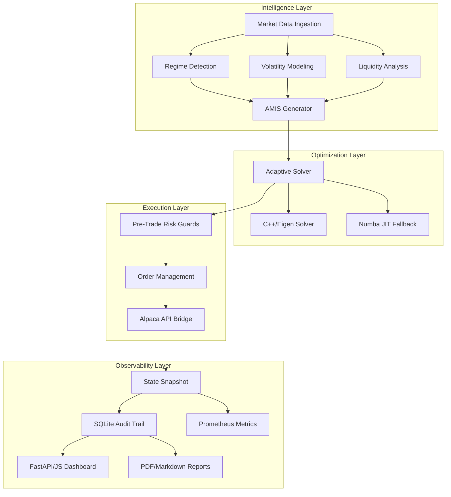

# AMIE-APO System Architecture

Unified framework for regime-aware portfolio optimization and execution.

## 🏗️ High-Level Design

## 🧠 Layer Breakdown

### 1. Intelligence Layer (AMIS)
The **Adaptive Market Intelligence Score (AMIS)** fuses triple-signal technology:
- **Regime Detection**: Hidden Markov Models (HMM) or statistical clustering to identify Bull, Bear, and Sideways periods.
- **Volatility Dynamics**: Hawkes processes and Monte Carlo simulations for shock propagation modeling.
- **Liquidity Estimation**: Bid-ask spread and market depth analysis to minimize slippage.

### 2. Optimization Layer
Dual-engine solver for high-performance numerical stability:
- **Primary**: C++ backend using Eigen for institutional-grade convex optimization.
- **Secondary/Verification**: Numba JIT-compiled Python for rapid prototyping and cross-validation of results.

### 3. Execution Layer
ハードened bridge for capital preservation:
- **Risk Guards**: Multi-check system (Weight sum = 1, individual caps, volatility scale).
- **Idempotency**: UUID-based order tracking to prevent double-execution.
- **Circuit Breakers**: Immediate kill-switch on abnormal slippage or connectivity loss.

### 4. Observability Layer
Full-stack monitoring:
- **Audit Logs**: Every decision cycle is logged with input signals and optimization state.
- **Prometheus/Grafana**: Real-time performance metrics (Sharpe, Drawdown, Latency).
- **Static Reports**: Automated generation of performance summaries for stakeholder review.
